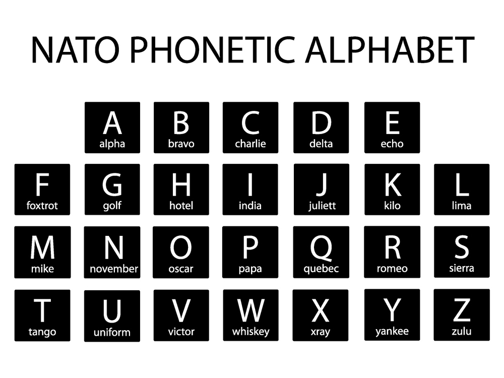

# <u>**NATO Phonetic Alphabet Project**</u>

## A project to convert a word into a NATO Phonetic Alphabet list.  

This Project is based on list & dictionary comprehension. A pdf is attached 
to the project so that if anyone is interested to know about the NATO 
phonetics.   

    
### <u>**Project:**</u>  
NATO Phonetic Alphabet Project 
100 Days of Code - The Complete Python Pro Bootcamp 2021  
Day 26 - Intermediate - List Comprehension and the NATO Alphabet